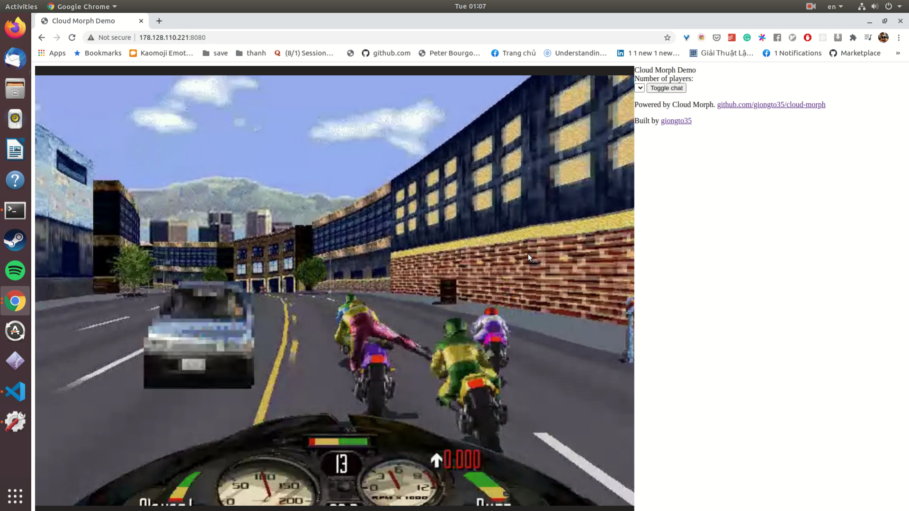
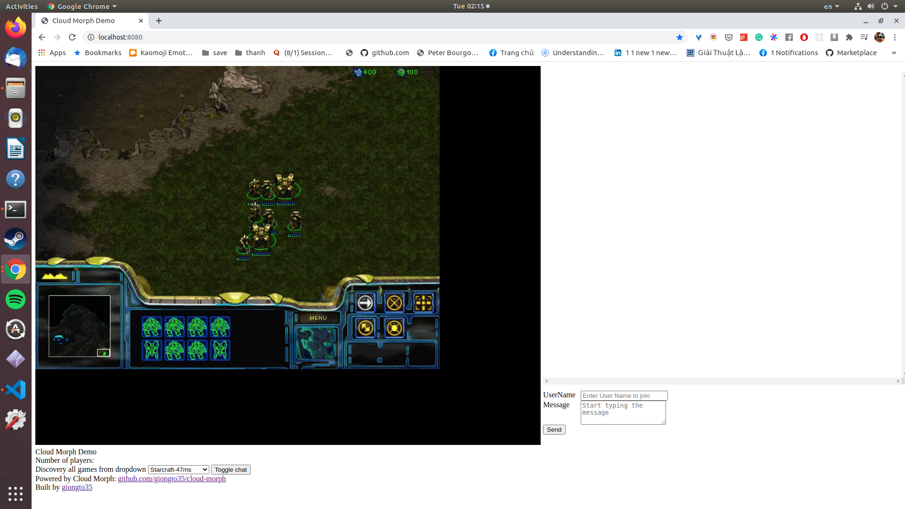

**Decentralized, Self-hosted cloud gaming/cloud application service.**

## Introduction

CloudMorph is a decentralized, self-hosted cloud gaming/cloud application platform. User can host their cloud gaming solution with minimum configuration. By leveraging the ease of deployment, CloudMorph goal is to build a decentralized cloud-gaming network with providers and consumers.  
To bring a scalable, performant and universal cloud gaming solution, CloudMorph has to cope with many technical challenges from Windows application Virtualization in headless server, OS event simulation, Video/Audio encoding pipeline and optimization, NAT traversal, P2P network structurization, etc.

**Discord**: [Join Us](https://discord.gg/ux2rDqwu2W)

## Demo

Video Demo: https://www.youtube.com/watch?v=fkOpOQ-HwFY

|                       Screenshot                       |                        Screenshot                         |
| :----------------------------------------------------: | :-------------------------------------------------------: |
|  [Diablo II US](http://us.clouddiablo.com/) |  Photoshop |
|  [RoadRash](https://www.youtube.com/watch?v=A2JcFaVlOO4) |  Starcraft  |

#### CloudMorph Demo
- [Cloud Diablo SG](http://clouddiablo.com/) (Demo of Collaborative play Diablo running on Singapore server using CloudMorph)
- [Cloud Diablo US](http://us.clouddiablo.com/) (Demo of Collaborative play Diablo running in US server).
Switch applications using the sidebar on the left.

#### Experience deployment on your own:
- Run `setup_remote.sh 111.111.111.111` with 111.111.111.111 is your host. What you will get is a Notepad hosted on your remote machine. More details about deployment is below

## Design Goal:
1. **Simplicity**: No API/ interface integration needed from application. One line script deployment to a public server to get work done.
2. **Mesh network**: Providers-Consumers over Peer To Peer communication. After joining the network, Provider's Application is discoverable and launched with one click.
3. **Modularizable**: A concise technical stack to **develop**/**deploy** for cloud gaming/ cloud application service.
4. **Generic/Cross-platform**: Run on web browser, web mobile. Target Windows App instead of relying on gaming framework/emulator. (like [CloudRetro](https://github.com/giongto35/cloud-game)).
5. **Scalable**: Be able to scale on headless machines cluster horizontally.

## Deployment

Foremost, you need an Ubuntu instance with a public network firewall. For example, you can use the given `script/create_do.sh` to create a digital ocean instance.
Then we need 3 in the same folder:
1. `config.yaml`: app config, the app configuration
3. `wine`: whole wine folder from `.wine`. If there is no wine folder, the basic wine envirnoment will be you.
5. `apps`: a folder contains the app you want to deploy. For example, `DiabloII`. If your application is from other folder ex "Program Files", we can leave it empty. We just need to configure the `config.yaml`
6. `setup_remote.sh`: a script to deploy your application to server

Run:
- `setup_remote.sh $ip`. Ex: `./setup_remote.sh 159.89.146.77`  
- Tutorial Video: https://www.youtube.com/watch?v=w8uCkfZdHVc

**Deployment with Lutris**
- Lutris eases the installation of a game on Linux. **The recommended flow is to install game with Lutris and copy produced wine environment to Cloud Morph**.

**Deployment Example**
- `script/example` contains example applications configuration. Note: `/apps` is left empty due to copyright.

# Technical
## Development

The service is based on Golang, C++, and Linux X11 utility tools (Xvfb, ffmpeg).
You can set up all dependencies with `setup.sh`. After that, you can run the go server with

- `go run server.go`

Access to your local at

- `localhost:8080`

Note: the wine application is run in Docker. You can run it without docker by changing `run-wine.sh` to `run-wine-nodocker.sh` in `server.go` for easier debugging.

### Design
#### Decentralize

- After running `setup-remote.sh` with configured `discoveryHost` attribute, application will be registered in Discovery list.
- Client will query discovery host list of joinable host, then the client can pick any application in the discovery list.

#### CloudApp Core

- When a Web Service starts, Application Container, named "CloudApp Core", is spawned. Inside the container there are Application + Virtual Display/Audio + Windows Event Simulation Utility. Multiple Containers can be spawned on demand.
- Input captured from Client is sent to Web Service using WebRTC Data Channel (UDP)
- Web Service will send received input events to Virtual Machine over a socket.
- The utility (syncinput.exe) will listen to the input events and simulates equivalent Windows OS event to Wine Application through WinAPI.
- Application screen/ Audio is captured in a Virtual Display Frame Buffer (XVFB)/ Virtual Audio (PulseAudio), which is later piped to FFMPEG.
- FFMPEG encode the Video Stream to VPX RTP stream and Audio Stream to Opus stream.

- Overall, the "CloudApp Core" module receives **Input** as WebSocket event and **Output** as RTP stream. It is packaged in container with the interface declared at `core/go/cloudapp`.

### Detailed Technology
#### WebRTC

- [WebRTC](https://en.wikipedia.org/wiki/WebRTC) is the leading technology for P2P communication. It eases P2P direct communication between Provider and Consumer.
  - NAT Traversal through ICE:
    - Find a best way for direct P2P communication that can bypass firewall.
  - RTP: Real Time Transport Protocol.
  - Builtin Streaming Video/Audio Encoding.
- With [Pion](https://github.com/pion/webrtc/) library in Go, WebRTC streaming becomes really handy.

#### Windows Virtualization on Linux OS

- Cloud Morph spawns application inside a virtualized Windows OS (using Wine) inside a Linux OS.
- Windows is the most popular OS for gaming application. Linux is development friendly and provides more programming utilities.
- Wine is a Windows Virtual Machine on Linux. Its performance for AAA game is proven in Steam PlayOnLinux, Lutris.
- Wine Application and its utilities is packaged in a Linux Docker container, so Web service can spawn new containers on demand.

#### Headless server

- Headless server is a server without display. When you acquire any cloud instances from AWS, Digital Ocean, GCloud..., it is headless because there is no display attached to it. Similar usage you can find in Chrome Selminium CI/CD pipeline.
- Being able to run the application in Headless will enable the ability to scale horizontally by improvisoning more cloud machines. 
- Graphic is captured in Virtual Frame Buffer (XVFB) and Audio is captured in Virtual Audio (pulseaudio). Encoding pipeline will fetch media from these virtual Display/Audio.

#### Video/Audio Encoding pipeline

- Encoding Pipeline for Video and Audio relies on powerful FFMPEG. 
- Web Service listen to FFMPEG result and pipe out to all users.

#### Inter Process Communication between Web Service and Cloud Gaming Container

- Any user interaction will be sent to Web Service and then Web Service will talk to Windows Application inside Container. Even Web Service and Application is inside the same machine, they communicate with each other using Websocket over a specified shared network port. Other kinds of Inter Process Communication is not applicable here.

#### Event Simulation

- Inside container, there is a "syncinput" utility that listen to user interaction over WebSocket and simulate Windows Application events over WindowsAPI.
- C++ is chosen because it has good support for WindowsAPI.

## Real-World Usecase

##### For Developers
- Experience playing/hosting Cloud Gaming on their own.
- Plugable Cloud gaming module: The cloud gaming core is packaged and virtualized to be easily extended to different tech stacks. E.g Python, Java ...

##### For Consumers.
- Multi-platform: be able to run web-browser, mobile web.
- Collaborative Gaming: Multiple people plays the same game. Ex. Twitch play pokemon, or like in http://clouddiablo.com/.

##### For Providers
- Playable Teaser: Application's teaser is playable, so users can experience new game directly on Browser.

## Road Map - Request for Help

- UI improvement
- Full Dockerization. Currently server is not run in Container.
- Port C++ Window API to Rust.
- GPU acceleration. - Integrate with FFMPEG job. 
- Multiplex application sessions. Currently, only collaborative mode is supported, which serves all application's sessions from the same single instance.
- Performance optimization.
- Web Mobile controller supprt. Currently, mouse click is already simulated.
- Packaging frontend as a plugin that can be imported in any Webpage.
