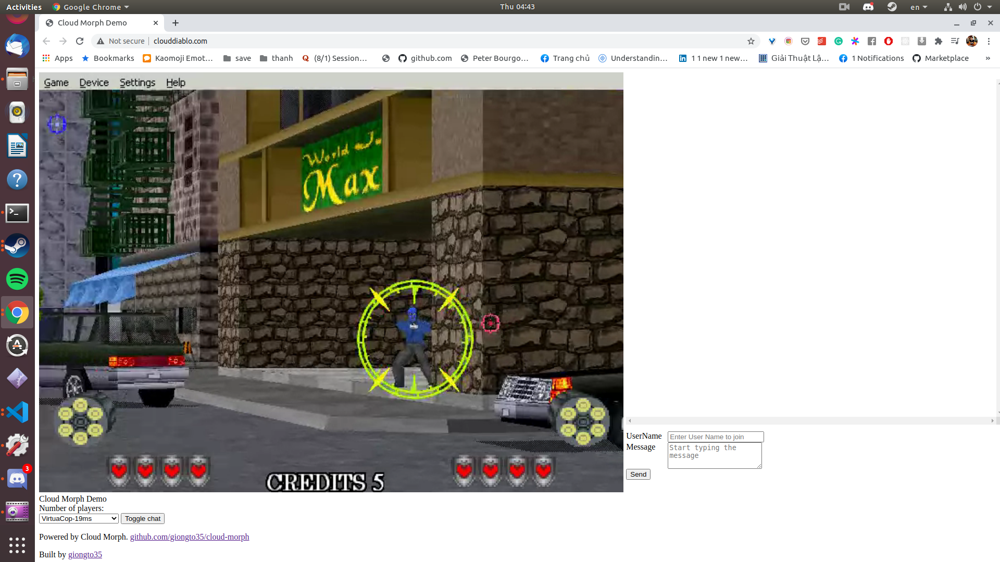

**Decentralized cloud gaming/cloud application service.**

## Introduction

CloudMorph is a decentralized cloud gaming/cloud application service. It still follows Cloud Gaming's idea: the application is run on remote servers, screen and user input are streamed back and forth between clients and server in optimal way. On top of that, it builds a decentralized network of cloudapp providers, and consumers, where providers can host their own cloudapp with a given toolset, and consumers can use any app in the network.  
Demo Diablo [cloudiablo.com](clouddiablo.com) hosted by CloudMorph : https://www.youtube.com/watch?v=fkOpOQ-HwFY

## Goal
Unlike **[CloudRetro](https://github.com/giongto35/cloud-game)**, a Completed Cloud Gaming solution on Retro Game hosted on dedicated cloud infrastructure, CloudMorph generalizes the system to bring any offline Window application to a cloud mesh network. The deployment is simplified with a concise tech-stack and codebase. The goal is to create a distributed cloud application system when anyone can contribute their offline application on the platform, and other people can consume it.

## Usecases

##### For Developers
- Experience playing/hosting Cloud Gaming on their own.
- Plugable Cloud gaming module: The cloud gaming core is packaged and virtualized to be easily extended to different tech stacks.

##### For Consumers.
- Multi-platform: be able to run web-browser, mobile web.
- Collaborative Gaming: Multiple people plays the same game. Ex. Twitch play pokemon, or http://clouddiablo.com/ - A cloudmorph demo.

##### For Providers
- Playable Teaser: Application's teaser is playable, 

## Design Goal:
1. **Mesh network**: Providers-Consumers over Peer To Peer communication.
2. **Modularizable**: A concise technical stack to **develop**/**deploy** for cloud gaming/ cloud application service.
3. **Generic/Cross-platform**: Run on web browser, web mobile. Target Window App instead of relying on gaming framework/emulator (like [CloudRetro](https://github.com/giongto35/cloud-game)).
4. **Scalable**: Be able to scale on headless machines cluster horizontally.
5. One line script deployment.

## Demo

|                       Screenshot                       |                        Screenshot                         |
| :----------------------------------------------------: | :-------------------------------------------------------: |
|  Diablo II |  Photoshop |
|  [RoadRash](https://www.youtube.com/watch?v=A2JcFaVlOO4) |  Photoshop  |

[Cloud Morph](http://clouddiablo.com/) (Running on US server). You can select other applications in the dropdown and it will be instantly loaded.
[Cloud Diablo](http://clouddiablo.com/) (Running on Singapore server)

## Deployment

Foremost, you need an Ubuntu instance with a public network firewall. For example, you can use the given `script/create_do.sh` to create a digital ocean instance.
After that:
We need 3  in the same folder:
1. `apps`: a folder contains the app you want to deploy. For example, `DiabloII`
2. `config.yaml` : app config, the app configuration on cloud-morph
3. `setup_remote.sh`: a script to deploy your application to server

Example:
- `setup_remote.sh $ip $mount_path`. Ex: `./setup_remote.sh 159.89.146.77 /apps/DiabloII`  
- Tutorial Video: https://www.youtube.com/watch?v=w8uCkfZdHVc

### Deployment with setup file
- Some offline game/application requires installation. The best flow I can think of is
1. Run `interactive-wine.sh bash`, it will open environment with bash on mounted volume. After we finish initialization, we will push this volume to remote server using the below line.
2.  `setup_remote.sh $ip $mount_path  syncvolume`

### Example
There are configuration examples without applications. You can search the app and put it in the same configuration folder.

## Development

The service is based on Golang, C++, and Linux X11 utility tools (Xvfb, ffmpeg).
You can set up all dependencies with `setup.sh`. After that, you can run the go server with

- `go run server.go`

Access to your local at

- `localhost:8080`

Note: the wine application is run in Docker. You can run it without docker by changing `run-wine.sh` to `run-wine-nodocker.sh` in `server.go` for easier debugging.

## Design

- **Mesh Network**

- **CloudApp core**

- When Webserver starts, Wine Application is spawned inside a container at the same time. However, in the future, Wine Application needs to support multiplex to run multiple applications in the same VM.
- Input captured from Client is sent to Virtual Machine over Websocket.
- A C++ script (syncinput.exe) will listen to the event and simulates Window's OS event to Wine Application through WinAPI.
- Application screen is captured in a Virtual Display Frame Buffer, which is later piped to FFMPEG.
- FFMPEG will produce the screen stream to a VPX RTP stream.

- In the end, the core module receives **Input** as WebSocket event and **Output** as RTP stream. You can check the interface at `core/go/cloudapp`
- Webserver interacts with Virtual Machine using these Input and Output format.

## Design choice

#### Why do I pick Linux Stack and Wine?

- First, I consider writing the whole system in Window. However, Window lacks programming utilities, and Linux is more comfortable for me.
- Wine is a Window Virtual Machine. Its performance is proven in Steam PlayOnLinux.
- I may revise on this decision: 

#### Headless server

- Headless server is a server without display. When you acquire any cloud instances from AWS, Digital Ocean, GCloud..., it is headless because there is no monitor attached to it.
- One of the most challenging problems is to deal with Headless when your application/game always requires a graphic monitor, graphic driver. Being able to run on a Headless server is a goal. We can improvision new application instances and scale gaming sessions properly.

#### Why XVFB, not X11VNC (Remote access)

- XVFB is a Virtual Frame Buffer. There is no monitor attached to the server, so XVFB is a virtual buffer that can capture image frames going to DISPLAY.

#### Why TCP socket for interaction between Server and Wine Application.

- Even though Wine application and server stay in the same machine, they theoretically run on different OS. Internal Process Communication becomes challenging and not suitable. Network communication using Websocket over some defined ports can help in this case.

#### Why Golang, FFMPEG, C++

- FFMPEG is used to grab XVFB Display (built-in functionality) and convert it to the VPX video stream. It can be substituted with GStreamer or any custom encoding solution.
- C++ is chosen because it has good support for WindowAPI.
- Golang is not really a crucial part of this design. It helps spawn Webserver conveniently. With [Pion](https://github.com/pion/webrtc/) library in Go, WebRTC streaming becomes really handy.

## Roadmap

- Fully Dockerize Webserver, so it's easier to setup.
- Multiplex application sessions. Currently, one server can spawn only one application, and all users access the same session. (Collaborative gameplay)
- Improve flow to deploy app needs initialization.
- Performance improvement.
- Packaging frontend as a component.
