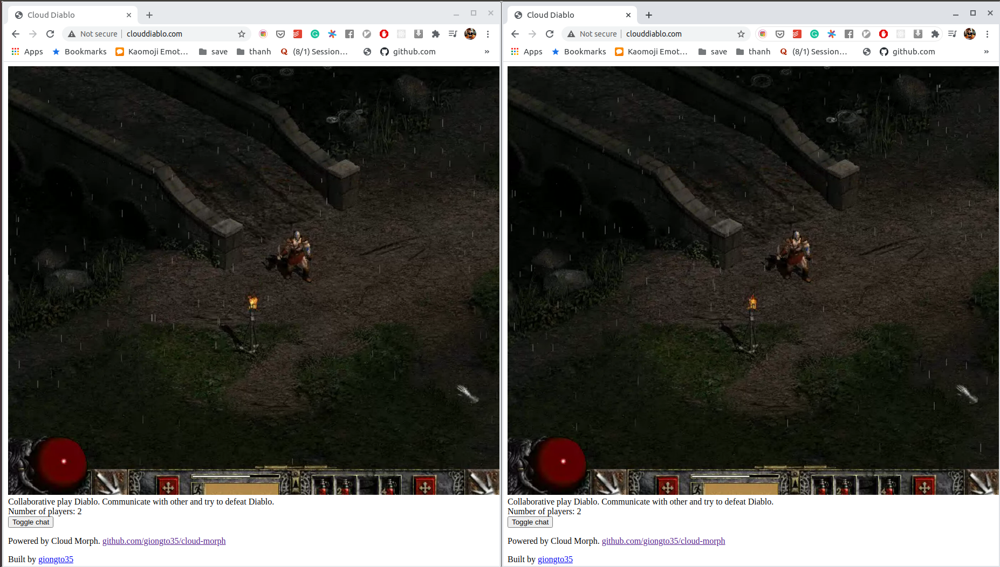
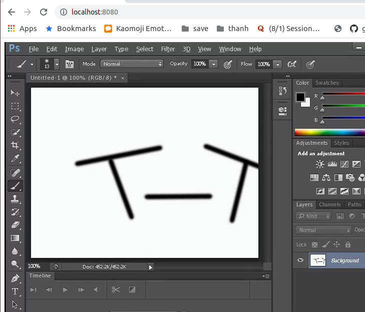

# CloudMorph

**(IN DEVELOPMENT, if you find any issues + requests + technical design question/contribution, please help raise it)**

Bring offline app to cloud, run directly on browser.

## Introduction

CloudMorph is a concise technical stack to run your own cloud gaming/ cloud application service. It follows the idea of Cloud Gaming: application is run on remote server, screen and user input are streamed back and forth between clients and server.

Unlike **[CloudRetro](https://github.com/giongto35/cloud-game)**, which is a Cloud Gaming service on Retro Game hosted by myself, CloudMorph generalizes the system to bring any offline Window application to Cloud. The deployment of system is aimed to be simple with concise techstack and codebase.
Users can either spawn up a cloud service by themself or optionally attach your hosting to our infrastructure. My goal is to create a distributed cloud application system when someone can contribute their offline application on the platform and other people can consume it.

|                       Screenshot                       |                        Screenshot                         |
| :----------------------------------------------------: | :-------------------------------------------------------: |
|  Diablo II |  Photoshop |

[Cloud Diablo](http://clouddiablo.com/) (Running on Singapore server)

## Deployment

After acquiring a Linux server from any cloud provider, you can ssh to it and do the following steps:

1. Clone the repo:  
   `https://github.com/giongto35/cloud-morph.git`
2. Run setup script:  
   `./setup.sh`
3. Put your exe file (can be a game) in `./winvm/games/`
4. Configure setup script:  
   `config.yaml`
   Ex:
   - `path: /games/Diablo ` (_/winvm/games_ is mounted to _/games_ in docker) - `appFile: DiabloII.exe` (name of the exe file name) - `windowTitle: Diablo` (substring of window title just to help the script to locate application process)
5. Start the service  
   `./server`
6. Open the host in browser with 8080. You can later route it with DNS  
   `xxx.xxx.xxx.xxx:8080`

## Development

The service is based on Golang, C++ and Linux X11 utility tools (Xvfb, ffmpeg).
You can setup all dependencies with `setup.sh`. After that you can run the go server with

- `go run server.go`

Access to your local at

- `localhost:8080`

Note: the wine application is run in Docker. You can run it without docker by changing `run-wine.sh` to `run-wine-nodocker.sh` in `server.go` for easier debuging.

## Design

- When Webserver is started, Wine Application is spawned inside a container at the same time. However, in the future, Wine Application needs to support multiplex to run multiple application in the same VM.
- Input captured from Client is sent to Virtual Machine over Websocket.
- A C++ script (synckey.exe) will listen to the event and simulates Window event to Wine Application by WinAPI.
- Application screen is captured in a Virtual Display Frame Buffer, which is later piped to FFMPEG.
- FFMPEG will produced the screen stream to a VPX RTP stream.

- In the end, the core module receives **Input** as websocket event and **Output** as RTP stream. You can check the interface at `core/go/cloudgame`
- Webserver interacts with Virtual Machine using these Input and Output format.

## Design choice

#### Why do I pick Linux Stack and Wine?

- First, I consider writing the whole system in Window. However, Window lacks programming utilities and Linux is more comfortable to me.
- Wine is a Window Virtual Machine. Its performance is proven in Steam PlayOnLinux.

#### Headless server

- Headless server is server without display. When you acquire any cloud instances from AWS, Digital Ocean, GCloud..., it is headless because there are no monitor attached to it.
- One of the hardest problems is to deal with Headless when your application/game always requires graphic monitor, graphic driver. Being able to run on Headless server is a goal. We can improvision new application instances, and scale gaming sessions properly.

#### Why XVFB, not X11VNC (Remote access)

- XVFB is a Virtual Frame Buffer. As mentioned above, there is no monitor attached to server, so XVFB is a virtual buffers that can capture image frames going to DISPLAY.

#### Why TCP socket for interaction between Server and Wine Application.

- Even though Wine application and server stay in the same machine, they theoritically run on different OS. Internal Process Communication become challenging and not suitable. Network communication using Websocket over some defined ports can help in this case.

#### Why Golang, FFMPEG, C++

- FFMPEG is used for grabbing XVFB Display (builtin functionality) and convert it to VPX video stream. It can be subtituted with GStreamer or any custom encoding solution.
- C++ is chosen because it has good support for WindowAPI.
- Golang is not really a crucial part in this design. It helps spawn Webserver conveniently. With [Pion](https://github.com/pion/webrtc/) library in Go, WebRTC streaming becomes really handy.

## Roadmap

- I need help to get review on Architecture + performance optimization.
- Fully Dockerize webserver, so it's easier to setup.
- Build Pipeline, lower down number of steps to deployment.
- Multiplex application sessions. Currently, one server can spawn only one application and all users access the same session. (Collaborative gameplay)
- Decentralized service with discovery + load balancing + latency awareness layer.
- Standardize component interaction. Currently packets are in comma-separated form.
- Packaging frontend as a component.
