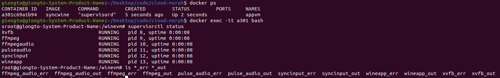
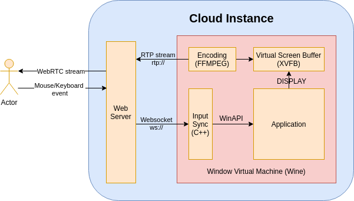

**Decentralized, Self-hosted Cloud Gaming service on WebBrowser.**  
**Video Demo**: https://youtu.be/eFR7fLy9z6E  
**Technical Document**: https://github.com/giongto35/cloud-morph/wiki  
**Landing Page**: https://cloudmorph.io  
**CloudRetro**: [https://github.com/giongto35/cloud-game](https://github.com/giongto35/cloud-game): Sister project, Cloud Gaming Service For Retro Games  

## Introduction

CloudMorph is a decentralized, self-hosted cloud gaming/cloud application platform. Users can quickly spawn up a cloud gaming service with minimal configuration. By leveraging the ease of deployment, CloudMorph goal is to build a decentralized cloud application network with app providers and consumers.  
CloudMorph copes with different technical challenges from OS to Cloud, such as Low-Latency Streaming, Video/Audio encoding pipeline and optimization, Windows application Virtualization in headless server, OS event simulation, NAT traversal, P2P network structurization, etc.  
Unlike [CloudRetro](https://github.com/giongto35/cloud-game), a completed Cloud Gaming solution for Retro Game run on its dedicated cloud infrastructure, CloudMorph decentralized hosting works to users with any Windows Games/Applications by a generic and modularized solution.

**Discord**: [Join Us](https://discord.gg/ux2rDqwu2W)

## Changelog
- 26/9/2021: Able to run in Windows/ Mac
- 19/6/2021: Modularize Frontend as Widget. All parts are independent

## Demo

Video Demo: https://www.youtube.com/watch?v=fkOpOQ-HwFY

|                       Screenshot                       |                     Screenshot                         |
| :----------------------------------------------------: | :----------------------------------------------------: |
|  [Diablo II-US](http://us.clouddiablo.com/) |  [Starcraft](http://cloudstarcraft.com/) |
|  [RoadRash](https://www.youtube.com/watch?v=A2JcFaVlOO4) |  Browse and Switch games |

#### CloudMorph Demo
- [Cloud Diablo SG](http://clouddiablo.com/) (Demo of Collaborative play Diablo running on Singapore server using CloudMorph).
- [Cloud Diablo US](http://us.clouddiablo.com/) (Demo of Collaborative play Diablo running in US server).
Switch applications using the sidebar on the left.

## Usecases

#### For Consumers.
- Play any provided application directly from Browser without Installation.
- i.e, clouddiablo.com is for playing Diablo on Browser collaboratively. When we have less time to finish a game, let's do it together?

#### For Providers
- Playable Ads: Instead of Video Teaser, Game/Application providers can let users interact with the application.
- Discoverable: Any application that joined the network will be surfaced to users over CloudMorph channel.

#### For Developers
- Experience playing/hosting Cloud Gaming on their own.
- Plugable Cloud gaming module: The cloud gaming core is packaged and virtualized to be extendable to different tech stacks. E.g Python, Java ...

## Getting Started
### Windows (WIP)
#### Running in Sandbox (Recommended)
To setup Window Sandbox, Turn on Virtualization in Bios and Enable Windows Sandbox Feature. Tutorial https://techgenix.com/install-configure-and-use-windows-sandbox/
1. Using `setup-sandbox.ps1` to download and install necessary packages (FFMPEG) in sandbox image (`winvm/pkg`)
2. `go run server.go`

#### Running without Sandbox
Without Sandbox, environment is not isolated, so mouse + keyboard simulation will target your main mouse + keyboard. If you play on the same machine, so you will experience your mouse is moving away.

1. Install globally dependencies: FFMPEG. Doesn't need to put in sandbox folder as 1
1. `go run server.go`

### Mac/Ubuntu
#### Running locally
1. Install Dependecies: Docker/Go. Or just `setup.sh` 
2. `go run server.go`

#### Running remotely
- Run `setup_remote.sh 111.111.111.111` inside `./script`, ``111.111.111.111`` is the address of your host. What you will get your application hosted on your remote machine. More details are in Deployment section below.

#### Debug in case you need
- If your run is succesful, there will be a Docker running in background. Inside Docker there are 5 apps is running and their logs are suffix with \_err \_out

## Design

#### Goal:
1. **Cloud gaming Philosophy**: The application run in the remote cloud instance. Video/Audio is streamed to users in the most optimal way. User interaction needs to have the lowest latency.
2. **Cross-platform compatibility**: The service is accessible in web-browser, the universal built-in that can fit multiple platforms like Desktop/Mobile. No console, plugin, external app, or devices are needed.
3. **Deployment Simplicity**: There is no API/ interface integration required to set up the integration. One line command to finish the deployment.
4. **Mesh network**: Providers-Consumers over Peer To Peer communication. After joining the network, Provider's Application is discoverable and immediately launched with one selection.
5. **Modularizable**: A concise technical stack to **develop**/**deploy** for cloud gaming/ cloud application service.
6. **Scalable**: Able to scale on headless machines cluster horizontally.

#### CloudApp Core

1. When a Web Service starts, Application Container, named "CloudApp Core", is spawned. Inside the Container there are Application + Virtual Display/Audio + Windows Event Simulation Utility. Multiple Containers can be spawned on demand.
2. Web Service is in charge of Webapp interface, P2P communication. When a user/client connects the service, the service will initialize a WebRTC connection between the client and service. This project uses [WebRTC Pion](https://github.com/pion/webrtc), which is a fantastic library for WebRTC in Golang.
3. Input captured from Client is sent to Web Service using WebRTC Data Channel (UDP).
4. Web Service sends received input events to Virtual Machine over a socket.
5. The utility (syncinput.exe) listens to the input events and simulates equivalent Windows OS events to Wine Application through WinAPI.
6. Application screen/ Audio is captured in a Virtual Display Frame Buffer (XVFB)/ Virtual Audio (PulseAudio), which is later piped to FFMPEG.
7. FFMPEG encodes the Video Stream to RTP (VPX/H264) stream and Audio Stream to Opus stream.  
8. Overall, "CloudApp Core" module receives **Input** as WebSocket event and **Output** as RTP stream. It is packaged in Container with the interface declared at `core/go/cloudapp`.  

#### Decentralize

- Discovery service is a centralized service, backed by etcd. In this flow, Client periodically query this service to get list of joinable host and show them in sidebar.
- For Provider, if the configuration in `config.yaml` includes `discoveryHost` attribute, application will be discoverable to user.

## Detailed Technology
[wiki](https://github.com/giongto35/cloud-morph/wiki)

## Development

The service is built using Golang, C++, and Linux X11 utility tools (Xvfb, ffmpeg).
You can set up all dependencies with `setup.sh`. After that, you can run the go server with

- `go run server.go`

Access to your local at

- `localhost:8080`

Note: the wine application runs inside Docker. You can run it without docker by changing `run-wine.sh` to `run-wine-nodocker.sh` in `server.go` for easier debugging.

### Explore and Contribute
- [Wiki Deep Dive Into Codebase](https://github.com/giongto35/cloud-morph/wiki/Deep-Dive-Into-Codebase)

## Deployment

First, we need an Ubuntu instance with a public network firewall (No firewall rule for P2P communication NAT traversal). You can get a VPS from any provider (like AWS, DigitalOcean)
We prepare below in the same directory  

*Required*:  
1. `config.yaml`: app config, the app configuration.
2. `apps`: the folder contains the app we will deploy. It is later mapped to `winvn/apps` in the remote instances. For example, `DiabloII`. If your application is already inside the synced wine environment at 2, ex "Program Files", we can skip it. We need to configure `config.yaml`, apppath to point to the correct app path.
3. `setup_remote.sh`: a copy of the script in `winvm/script` to deploy your application to server.  

*Optional*:  
4. `wine`: whole wine folder from `.wine`. If there is no wine folder, the deployment uses the default `.wine` from installation.

After that, we run `setup_remote` from inside the folder:
- `setup_remote.sh $ip`. Ex: `./setup_remote.sh 159.89.146.77`  
- Tutorial Video: https://www.youtube.com/watch?v=w8uCkfZdHVc

**Deployment Example**
- `script/example` contains example applications configuration. Note: `/apps` is left empty due to copyright.

**Deployment with Lutris**
- Lutris eases the installation of a game on Linux. **The recommended flow is to install game with Lutris and copy produced wine environment in .wine folder to Cloud Morph**.

## Road Map - Request for Help

- UI improvement
- Full Dockerization. Only core is packaged, server is not run in Container.
- Port C++ Window API to Rust.
- GPU acceleration. - Integrate with FFMPEG job. 
- Multiplex application sessions. Currently, only collaborative mode is supported, which serves all application sessions from the same single instance.
- Performance optimization.
- Web Mobile controller support. Only mouse click is simulated.

